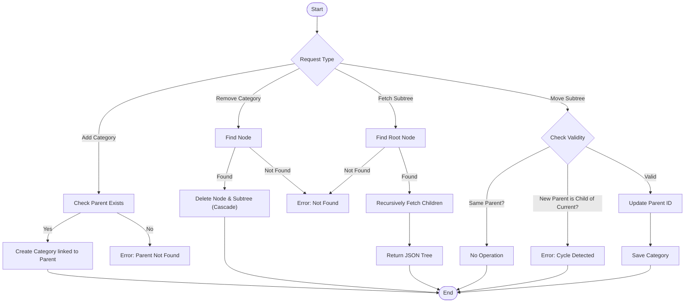

# Event Manager - Categories API

This project is a solution for the Baobab Nigeria Recruitment Code Challenge. It implements a REST API to manage event categories in an infinite depth tree structure.

## Features

- **Infinite Depth Tree**: Categories can be nested indefinitely using a self-referencing Adjacency List model.
- **Cycle Detection**: Prevents moving a category into its own subtree.
- **CRUD Operations**: Add, Remove, Fetch Subtree, Move Subtree.
- **Documentation**: Integrated Swagger/OpenAPI documentation.

## Tech Stack

- **Java 17**
- **Spring Boot 3.4.0**
- **Spring Data JPA**
- **PostgreSQL**
- **Docker** (Optional, for database)

## Flow Chart

The following diagram illustrates the logic for the key operations, including the cycle detection in "Move Subtree".



## Setup & Running

### Prerequisites

- Java 17+ installed
- Docker installed (Recommended for database to avoid conflicts)

### Database Configuration

This project uses PostgreSQL. To avoid conflicts with local instances, the provided `compose.yaml` maps the database to port **5433**.

1. Start the database:

   ```bash
   docker compose up -d
   ```

2. If you prefer a manual setup, ensure your database is running and update `src/main/resources/application.properties`:
   ```properties
   spring.datasource.url=jdbc:postgresql://localhost:5433/eventmanager
   spring.datasource.username=postgres
   spring.datasource.password=postgres
   ```

### Build and Run

```bash
./mvnw clean install
./mvnw spring-boot:run
```

## API Documentation

Once the application is running, you can access the Swagger UI at:
http://localhost:8080/swagger-ui/index.html

### Key Endpoints

| Method | Endpoint                | Description                                                |
| ------ | ----------------------- | ---------------------------------------------------------- |
| POST   | `/categories`           | Create a new category                                      |
| GET    | `/categories/{id}`      | Fetch a category and its subtree                           |
| DELETE | `/categories/{id}`      | Delete a category and its subtree                          |
| PUT    | `/categories/{id}/move` | Move a subtree to a new parent (query param `newParentId`) |

## Testing

Run unit tests with Maven:

```bash
./mvnw test
```

The tests cover:

- Service logic for adding/removing.
- Recursive fetching.
- Validation logic for moving subtrees (cycle detection).
